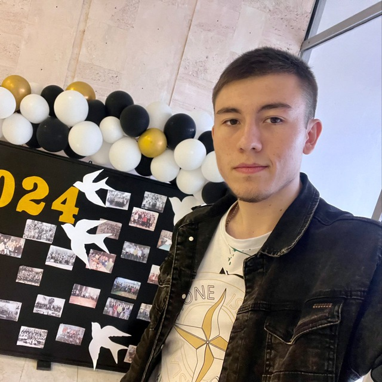

# Приветствие 

Привет! Меня зовут Богданов Юрий, и я - студент Государственного Университета Молдовы, факультет Математики и Информатики, департамент Информатики.

### Фотография / аватар

  

### Краткое описание себя

Мне 20 лет,я с города Твардица, мне нравится футбол, осообнно у меня особенная симпатия к клубу Реал Мадрид с детства, люблю также компьютрные игры.
Иногда, в свободное время, увлекаюсь игрой в шахматы и шашки Я думаю, что я дружелюбный, любознательный, общительный и иногда стеснительный.

### Области интересов

- футбол
- вождение машины
- программирование

### Языки программирования

1. Я знаю (в некоторой степени):

- Python
- С++

#### Я изучаю:

- php
- java

#### Я хочу изучить:

- в лучшей степени выучить язык программирования java
- в лучшей степени выучить язык программирования php

### Как со мной связаться

- **Email**: [gmail](https://mail.google.com/mail/u/0/?tab=rm&ogbl#inbox)
- **GitHub**: [iurii1801](https://github.com/iurii1801)
- **Telegram**: [ТГ](https://t.me/bogdanov_18i)
- **Instagram**:[instagram](https://www.instagram.com/bogdanov_18_/) 
