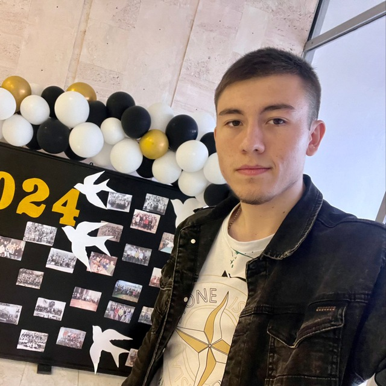

# Приветствие

Привет! Меня зовут Богданов Юрий, и я - студент Государственного Университета Молдовы, факультет Математики и Информатики, департамент Информатики.

### Фотография / аватар

  

### Краткое описание себя

Мне 20 лет,я с города Твардица, мне нравится футбол, особенно у меня особенная симпатия к клубу Реал Мадрид с детства, люблю также компьютерные игры.

Иногда, в свободное время, увлекаюсь игрой в шахматы и шашки. 

Я думаю, что я дружелюбный, любознательный, общительный и иногда стеснительный.

### Области интересов

- футбол
- вождение машины
- программирование

### Языки программирования

- Я знаю (в некоторой степени):
  - Python
  - C++

- Я изучаю:
  - PHP
  - Java

- Я хочу изучить:
  - В лучшей степени выучить:
    - Java
    - PHP

### Как со мной связаться

- **Email**: iurcikbogdanov18@gmail.com
- **GitHub**: [iurii1801](https://github.com/iurii1801)
- **Telegram**: [ТГ](https://t.me/bogdanov_18i)
- **Instagram**:[instagram](https://www.instagram.com/bogdanov_18_/)  
